---
header-includes:
   - \fancyhead[R]{Joshua Cook // Lab 5}
   - \fancyhead[L]{Homework and Lab Assignment \# 5 – ODEs}
---
In this assignment you will write a Python script to solve ODEs using a
second order Runge-Kutta method. You will also analyze and verify the
order of the method, and use your code to solve a first order ODE and
the linearized pendulum equation, a second order ODE, by writing it as a
first order system.

~~~
import math
import numpy as np
import matplotlib.pyplot as plt
from matplotlib import cm
%matplotlib inline
~~~

\subsection*{Implementation and Plotting of Euler's Method}

~~~
def eulers_method(t0, y0, f, h, N):
	euler_soln = np.zeros((N+1,2))
	euler_soln[0][0] = t0
	euler_soln[0][1] = y0
	for i in range (N):
			i += 1
			euler_soln[i][1] = euler_soln[i-1][1] + h*f(euler_soln[i-1][0],euler_soln[i-1][1])
			euler_soln[i][0] = euler_soln[i-1][0] + h
	return euler_soln

f = lambda t,x: -.1*(x-20)
			
soln = eulers_method(0,150,f,3,10)

plt.plot(soln[:,0],soln[:,1])
~~~

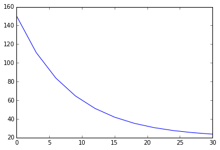

\pagebreak

**Second order Runge-Kutta Method:** Given the first order ODE

\begin{align*}
\frac{dy}{dt}=f(y(t),t),\ \ t\in(t_0,t_f],\ \ y(t_0)=y_0\tag{1}
\end{align*}

we consider the two-stage Runge-Kutta method:

\begin{align*}
k_1&=\Delta tf(y_n,t_n)\tag{2a}\\
k_2&=\Delta tf\bigg(y_n+\frac{k_1}{2},t_n+\frac{\Delta t}{2}\bigg)\tag{2b}\\
y_{n+1}&=y_n+k_2\tag{2c}
\end{align*}
to approximate its solution.

# Problem 1. 
Find the local truncation error of the
Runge-Kutta method by comparing the Taylor expansion of $y(t_{n+1})$ and
that of $y(t_n) + \Delta t f(y(t_n) + \frac{k_1}{2}, t_n + \frac{\Delta t}{2})$,
around $t_n$, noting that the Taylor expansion of $f(y + h, t + k)$
around $(t,y)$ is

$$\begin{aligned}
f(y + h, t + k) = & f(y, t) + h \frac{\partial f}{\partial y}(t,y) + k
\frac{\partial f}{\partial t}(t,y)
 + \frac12 \left( h^2 \frac{\partial^2 f}{\partial y^2}(t,y) + 2 h k
\frac{\partial^2 f}{\partial y \partial t}(t,y) + k^2 \frac{\partial^2
f}{\partial t^2}(t,y) \right) + {\cal O}(h^3,k^3). \end{aligned}$$

### Higher Derivatives
\begin{align*}
y'(t)&=f(t,y(t))\\
y''(t)&=f_t+f_yy'(t)\\
&=f_t+f_yf(t,y(t))\\
\end{align*}

### Taylor Expansion, $y_{n+1}$
\begin{align*}
y_{n+1}=y(t+h)&=y(t)+hy'(t)+\frac{h^2}{2}y''(t)+\mathcal{O}(h^3)\\
&=y+hf+\frac{h^2}{2} \left( f_t+f_yf \right) +\mathcal{O}(h^3)\\
&=y+h\left(f +\frac{h}{2}f_t+\frac{h}{2}f_yf \right) +\mathcal{O}(h^3)\\
&=y+h\left(f(t+h/2,y+hf/2) -\frac12 \left( h^2 \frac{\partial^2 f}{\partial
y^2}(t,y) + 2 h k \frac{\partial^2 f}{\partial y \partial t}(t,y) + k^2
\frac{\partial^2 f}{\partial t^2}(t,y) \right) + {\cal O}(h^3,k^3) \right) \\ & \ \ \ \ \ \ 
+\mathcal{O}(h^3)\\
&=y+h\left(f(t+h/2,y+hf/2)\right) -\frac{h}{2} \left( h^2 \frac{\partial^2
f}{\partial y^2}(t,y) + 2 h k \frac{\partial^2 f}{\partial y \partial t}(t,y) +
k^2 \frac{\partial^2 f}{\partial t^2}(t,y) \right)\\ & \ \ \ \ \ \ + {\cal O}(h^3,k^3)
+\mathcal{O}(h^3)\\
&=RK_2(t_n,y_n) -\frac{h}{2} \left( h^2 \frac{\partial^2 f}{\partial y^2}(t,y) +
2 h k \frac{\partial^2 f}{\partial y \partial t}(t,y) + k^2 \frac{\partial^2
f}{\partial t^2}(t,y) \right) + {\cal O}(h^3,k^3)  +\mathcal{O}(h^3)\\
E = y_{n+1}-RK_2(t_n,y_n)&=-\frac{h}{2} \left( h^2 \frac{\partial^2 f}{\partial
y^2}(t,y) + 2 h k \frac{\partial^2 f}{\partial y \partial t}(t,y) + k^2
\frac{\partial^2 f}{\partial t^2}(t,y) \right) + {\cal O}(h^3,k^3)
+\mathcal{O}(h^3)\\
\end{align*}

Note that all terms on the right side are of order ${\cal O}(h^3,k^3)$ and
therefore, the error term is also of this order.

\pagebreak

# Problem 2. 

Write a function, `RK2_step`, that implements one step of the above Runge-Kutta method. The function should take as input the name of the function $f(y(t), t)$ describing the right
hand side of equation (1), $y_n$, $t_n$, and $\Delta t$, and returns
$y_{n+1}$.

    def RK_step(fn,tn,yn,delta_t):
        k1=delta_t*fn(tn,yn)
        k2=delta_t*fn(tn+1./2*delta_t,yn+1./2*k1)
        return yn+k2

\pagebreak

# Problem 3.
Write a function called
`RK2_method` within the same file as the function in problem \#2) that
takes as input the name of the python function defining $f(y(t),t)$,
$t_0$, $t_f$, $y_0$, and $\Delta t$ and returns as output two 1d `numpy`
arrays `y` and `t` containing the approximate solution of the ODE and
the time values it was computed at. Your function should do the
following:

1. Determine the number, $N$, of values $t_n \in [t_0, t_f]$ at which the
solution will be calculated, calculate those values, and store them in
the 1d array, `t`. These values are $t_n = t_0 + n \Delta t$ for
$n = 0, 1, 2, \dots, N-1$ and $T_N = t_f$. You should make sure the last
time step size passed to the function `RK2_step`, $\Delta t^*$, is
calculated so that $t_f = t_{N-1} + \Delta t^*$.

2. Create the 1d array of size $N$, `y`, to hold the solution at the
corresponding values stored in `t`.

3. Call the function `RK2_step` $N$ times to calculate $y_{n+1}$ for
$n = 0, 1, \dots N$.

~~~
def RK_method(fn,t0,tf,y0,delta_t):
		N = (int)((tf-t0)/delta_t)
		rk_soln = np.zeros((N+1,2))
		rk_soln[0] = [t0,y0]
		for i in range(N):
				[t,y] = rk_soln[i]
				i += 1
				y = RK_step(fn,t,y,delta_t)
				t = t + delta_t
				rk_soln[i] = [t,y]
				
		return rk_soln, N
		

f = lambda t,y: -y
		
print RK_method(f,0,11,1,1)

(array([[  0.00000000e+00,   1.00000000e+00],
			 [  1.00000000e+00,   5.00000000e-01],
			 [  2.00000000e+00,   2.50000000e-01],
			 [  3.00000000e+00,   1.25000000e-01],
			 [  4.00000000e+00,   6.25000000e-02],
			 [  5.00000000e+00,   3.12500000e-02],
			 [  6.00000000e+00,   1.56250000e-02],
			 [  7.00000000e+00,   7.81250000e-03],
			 [  8.00000000e+00,   3.90625000e-03],
			 [  9.00000000e+00,   1.95312500e-03],
			 [  1.00000000e+01,   9.76562500e-04],
			 [  1.10000000e+01,   4.88281250e-04]]), 11)
~~~

\pagebreak

# Problem 4.
In the same file as you
wrote the functions in problems \#1 and \#2, write a function describing
$\displaystyle f(y(t),t) = 4 \, y\, (1 - y)$ and add the necessary code
to solve (1) with this $f(y,t)$ as the right hands side, $t_0 = 0$,
$t_f = 1.0$, and $y_0 = 0.1$ using those functions, and plot the
computed solutions as needed to obtain:

(a) Plots of the solution ($y \, vs. \, t$) calculated with
$\Delta t = 0.125, 0.0625, 0.03125$.

(b) An estimate of the order of the method using Aitken’s extrapolation.

~~~
g = lambda t,y: 4*y*(1-y)

def RK_plot(fn,t0,tf,y0,delta_t):
		[soln,N] = RK_method(fn,t0,tf,y0,delta_t)
		plt.plot(soln[:,0],soln[:,1])
		
RK_plot(g,0,1,0.1,0.125)
~~~

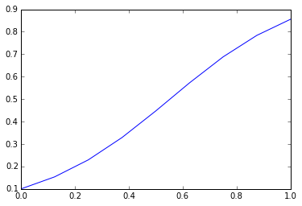

~~~
RK_plot(g,0,1,0.1,0.0625)
~~~

~~~
RK_plot(g,0,1,0.1,0.03125)
~~~

\pagebreak

### Aitken's Extrapolation
Consider our Runge Kutte method driving toward a final value at some $t_f=T$.
For example, the following on the $g$ function defined above.

~~~
print RK_method(g,0,1.5,0.1,.125)

(array([[ 0.        ,  0.1       ],
			 [ 0.125     ,  0.15374688],
			 [ 0.25      ,  0.22953489],
			 [ 0.375     ,  0.3289397 ],
			 [ 0.5       ,  0.44722611],
			 [ 0.625     ,  0.57218534],
			 [ 0.75      ,  0.68828987],
			 [ 0.875     ,  0.78402563],
			 [ 1.        ,  0.85577086],
			 [ 1.125     ,  0.9060304 ],
			 [ 1.25      ,  0.93973125],
			 [ 1.375     ,  0.96172302],
			 [ 1.5       ,  0.97583738]]), 12)
~~~

We are interested the effect that a smaller step size has on the convergence of
the solution, and thus the order of the error of the method.

If we assume that the error converges asymptotically to some fixed value, $C$,
then the error can be expressed as

$$y(T)-y_{\Delta T}(T)=C\Delta t^n$$

where $n$ is the number of iterations we have gone through in seeking our final
value.

Furthermore, we can express the ratios of error for several different step sizes
thusly:

\begin{align*}
\frac{y_{\Delta T}(T)-y_{\Delta T/2}(T)}{y_{\Delta T/2}(T)-y_{\Delta T/4}(T)}&=
\frac{(y_{\Delta T}(T)-(y(T))-(y_{\Delta T/2}(T)-y(T))}{(y_{\Delta
T/2}(T)-y(T))-(y_{\Delta T/4}(T)-y(T))}\\
&=\frac{C\Delta t^n-C\left(\frac{\Delta t}{2}\right)^n}{C\left(\frac{\Delta
t}{2}\right)^n-C\left(\frac{\Delta t}{4}\right)^n}\\
&=\frac{1-\left(\frac{1}{2}\right)^n}{\left(\frac{1}{2}\right)^n-\left(\frac{1}{
4}\right)^n}\\
&=\frac{1-\left(\frac{1}{2}\right)^n}{\left(\frac{1}{2}\right)^n\left(1-\left(\frac{1}{2}\right)^n\right)}=2^n\\
\frac{y_{\Delta T}(T)-y_{\Delta T/2}(T)}{y_{\Delta T/2}(T)-y_{\Delta
T/4}(T)}&=2^n\\
n&=\frac{\ln\left(\frac{y_{\Delta T}(T)-y_{\Delta T/2}(T)}{y_{\Delta
T/2}(T)-y_{\Delta T/4}(T)}\right)}{\ln 2}
\end{align*}

Therefore, the Aitken value we can calculate should be close to 2 which makes
sense for the second order Runge Kutta method being used.

~~~
def Aitken(fn,t0,tf,y0,delta_t):
    [yT,N] = RK_method(fn,t0,tf,y0,delta_t)
    [yT_2,N_2]  = RK_method(fn,t0,tf,y0,delta_t/2)
    [yT_4,N_4]  = RK_method(fn,t0,tf,y0,delta_t/4)
    return math.log((yT[N,1]-yT_2[N_2,1])/(yT_2[N_2,1]-yT_4[N_4,1]))/math.log(2)
    
Aitken(lambda t,y: 4*y*(1-y),0,1.5,0.1,.125), Aitken(lambda t,y: y**2,0,1.5,0.1,.125), 
    Aitken(lambda t,y: t*y*(1-y),0,1.5,0.1,.125), Aitken(lambda t,y: t*y**2,0,1.5,0.1,.125),

(2.231051804229441, 1.9807794437478738, 1.943694750721091, 1.9758113824326695)
~~~

\pagebreak

\section*{Runge Kutta for multiple initial values}

~~~
def RK_multiplot(fn,t0,tf,y0,y_max,delta_t):
		k=(int)((y_max-y0)/delta_t)
		for i in range(k+1):
				[soln,N] = RK_method(fn,t0,tf,y0+i*delta_t,delta_t)
				plt.plot(soln[:,0],soln[:,1])
		
RK_multiplot(lambda t,y: 4y(1-y),0,1,0,5,0.125)
~~~

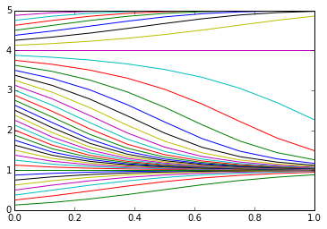

~~~
RK_multiplot(lambda t,y: 3*t*y*(1-t),0,1,0,5,0.125)
~~~

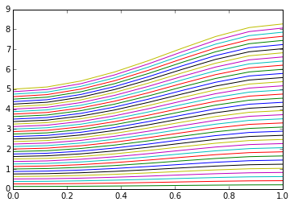

~~~
RK_multiplot(lambda t,y: 3*t*(1-.5*y),0,4,0,5,0.125)
~~~

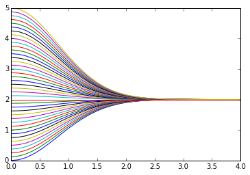

~~~
RK_multiplot(lambda t,y: -.4*y**y,0,2,0,4,0.125)
~~~

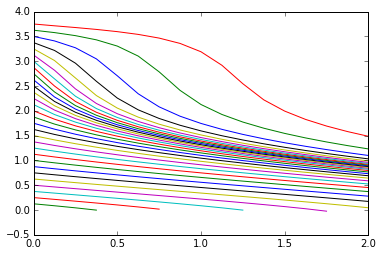

\pagebreak

\ 

\pagebreak

#  Problem 5. 

Consider the linearized pendulum equation

$$
\frac{d^2 \theta}{dt^2} = -\frac{g}{L} \theta, \ \ \ \theta(0) = \theta_0, \ \
\theta'(0) = v_0\tag{4}
$$

where $g = 9.81 m/s^2$ stands
for the acceleration of gravity, $L$ is the length of the rod holding
the pendulum’s bob, and theta is the angle displacement measured
counter-clockwise from the negative $y$ axis.

(a)\ \ \ \ 

   (i) Verify that $\theta(t) = a \cos{\omega t} + b \sin{\omega t}$, where
$\omega = g/L$ satisfies the equation, and

   (ii) determine $a$ and $b$ in terms of the initial conditions, and

   \begin{align*}
   \frac{d^2 \theta}{dt^2} &= -\frac{g}{L} \theta, \ \ \ \theta(0) = \theta_0, \
\ \theta'(0)=v_0\\
   \implies \lambda = \omega^2 &= -\frac{g}{L}\\
   \theta(t) &= a \cos{\omega t} + b \sin{\omega t}\\
   \theta(0)=\theta_0 \implies a &=\theta_0\\
   \theta'(0)=v_0 \implies b&=\frac{v_0}{\omega}\\
   \theta(t) &= \theta_0 \cos{\omega t} + \frac{v_0}{\omega} \sin{\omega t}\\
   \end{align*}

   (iii) find the period, $T$, of the oscillations of the pendulum (*i.e.*, find
$T$ such that $\theta(t + T) = \theta(t)$).

   \begin{align*}
   \omega T &= 2\pi\\
   T&=2\pi\sqrt{\frac{ L}{g}}
   \end{align*}

(b) Write the 2nd order ODE as a first order system of ODEs.

   Let $\theta_1=\theta(t)$ and $\theta_2=\dot{\theta}$ and
$\mathbf{\vec{\theta}}=\mmx{\theta_1}{\theta_2}$.

   $$\mathbf{\dot{\vec{\theta}}}=\mmx{\theta_2}{-\frac{g}{L}
\theta_1}=\mmxx{0}{1}{-\frac{g}{L}}{0}\ \vec{\theta}$$

Write a function, `pendulum_exact` that takes as input $L$, $t_0$, $T$,
$\theta_0$, $v_0$, and $\Delta t$, and returns the exact solution of the
pendulum equation computed at the times $t_n = t_0 + n \Delta t$ for
$t \in [0, 2T]$.

    def pendulum_exact(L,t0,periods,theta0,v0,delta_t):
        T = 2*np.pi*np.sqrt(L/9.81)
        N = (int)(T*periods/delta_t)
        soln = np.zeros((N+1,2))
        soln[:,0] = np.linspace(0,T*periods,N+1)
        omega = math.sqrt(9.81/L)
        soln[0][0] = t0
        soln[0][1] = theta0
        for i in range (N):
            i += 1
            t = soln[i][0]
            soln[i][1] = theta0*np.cos(omega*t)+v0/omega*np.sin(omega*t)
        return soln
    
    pend = pendulum_exact(1,0,3.5,-.2,.2,.05)
    plt.plot(pend[:,0],pend[:,1])

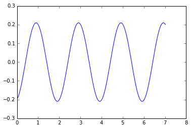

\pagebreak

 $$\mathbf{\dot{\vec{\theta}}}=\mmx{\theta_2}{-\frac{g}{L}
\theta_1}=\mmxx{0}{1}{-\frac{g}{L}}{0}\ \vec{\theta}$$

Write a python function named `fpendulum` describing the right hand side
of your system and solve the equation using `RK2_method` for
$t \in [0, 2T]$ for the following conditions (in all cases use
$\Delta t = 0.1$):

$L = 2$, $\theta(0) = \frac{\pi}{6}$, $v(0) = 0$.

$L = 1$, $\theta(0) = \frac{\pi}{3}$, $v(0) = 0$.

$L = 1$, $\theta(0) = 0$, $v(0) = \frac{\pi}{10}$

    fpendulum = lambda Theta,L: np.array([[0,1],[-9.81/L,0]]).dot(Theta)
    
    Theta_1 = np.array([np.pi/6,0])
    Theta_2 = np.array([np.pi/3,0])
    Theta_3 = np.array([0,np.pi/10])
    
    print Theta_1
    print Theta_2
    print Theta_3

    [ 0.52359878  0.        ]
    [ 1.04719755  0.        ]
    [ 0.          0.31415927]

    def RK_pend_step(Theta,L,delta_t):
        k1=delta_t*fpendulum(Theta,L)
        k2=delta_t*fpendulum(Theta+1./2*k1,L)
        return Theta+k2
    
    Theta_11 = RK_pend_step(Theta_1,2,0.1)
    Theta_12 = RK_pend_step(Theta_11,2,0.1)
    Theta_13 = RK_pend_step(Theta_12,2,0.1)
    
    print Theta_1
    print Theta_11
    print Theta_12
    print Theta_13

    [ 0.52359878  0.        ]
    [ 0.51075752 -0.2568252 ]
    [ 0.47254867 -0.50105312]
    [ 0.4108541  -0.72054992]

    def RK_pend_method(Theta,periods,L,delta_t):
        T = 2*np.pi*np.sqrt(L/9.81)
        N = (int)(T*periods/delta_t)
        time = np.linspace(0,T*periods,N+1)
        rk_soln = np.zeros((N+1,2))
        rk_soln[0] = Theta
        for i in range(N):
            i += 1
            Theta = RK_pend_step(Theta,L,delta_t)
            rk_soln[i] = Theta
    
        return time, rk_soln, N
        
    Pendulum_1_RK    = RK_pend_method(Theta_1,1.3,2,.1)
    Pendulum_1_exact = pendulum_exact(2,0,1.3,np.pi/6,0,.1)
    Pendulum_1_error = np.abs(Pendulum_1_RK[1][:,0]-Pendulum_1_exact[:,1])
    Pendulum_2_RK    = RK_pend_method(Theta_2,1.3,1,.1)
    Pendulum_2_exact = pendulum_exact(1,0,1.3,np.pi/3,0,.1)
    Pendulum_2_error = np.abs(Pendulum_2_RK[1][:,0]-Pendulum_2_exact[:,1])
    Pendulum_3_RK    = RK_pend_method(Theta_3,1.3,1,.1)
    Pendulum_3_exact = pendulum_exact(1,0,1.3,0,np.pi/10,.1)
    Pendulum_3_error = np.abs(Pendulum_3_RK[1][:,0]-Pendulum_3_exact[:,1])

Compute the exact solution for the same conditions and for each case
produce two plots: $(i)$ $y_{exact} \, vs. \, t$ and
$y_{RK2} \, vs. \, t$ (in the same axis), and $(ii)$ the error
$|y_{RK2} - y_{exact}|$. note that in this case, `RK2_method` should
return the 1d array `t` and a 2d array of size $(N+1) \times 2$ holding
the values of $\theta'$ and $\theta$ in columns 1 and 2 respectively.
**Submission:** Upload a `.pdf` file with the solution of
these problems and a files containing the functions `RK2_step`,
`RK2_method`, `fpendulum`, and the additional code you wrote to solve
the pendulum equation to

\pagebreak

#### Pendulum 1

    plt.figure(figsize=(10,6))
    plt.subplot(1, 2, 1)
    plt.plot(Pendulum_1_RK[0],Pendulum_1_RK[1][:,0],label="RK2")
    plt.plot(Pendulum_1_exact[:,0],Pendulum_1_exact[:,1],label="Exact")
    plt.legend()
    plt.axhline()
    plt.ylim((-1.5,1.5))
    plt.subplot(1, 2, 2)
    plt.plot(Pendulum_1_RK[0],Pendulum_1_error,label="Error")
    plt.legend()

    <matplotlib.legend.Legend at 0x10d683310>

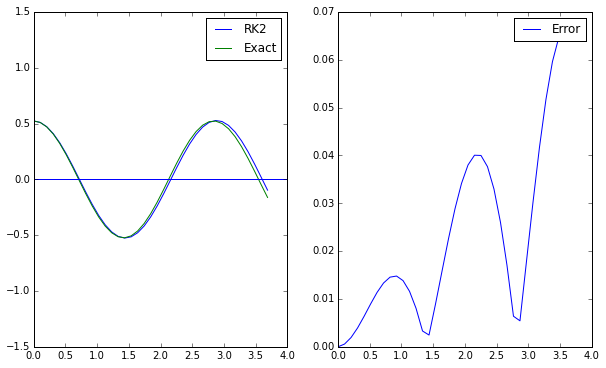

\pagebreak

#### Pendulum 2

    plt.figure(figsize=(10,6))
    plt.subplot(1, 2, 1)
    plt.plot(Pendulum_2_RK[0],Pendulum_2_RK[1][:,0],label="RK2")
    plt.plot(Pendulum_2_exact[:,0],Pendulum_2_exact[:,1],label="Exact")
    plt.legend()
    plt.axhline()
    plt.ylim((-1.5,1.5))
    plt.subplot(1, 2, 2)
    plt.plot(Pendulum_2_RK[0],Pendulum_2_error,label="Error")
    plt.legend()

    <matplotlib.legend.Legend at 0x10e3b1c50>

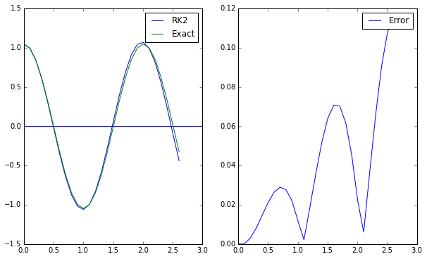

\pagebreak

#### Pendulum 3

    plt.figure(figsize=(10,6))
    plt.subplot(1, 2, 1)
    plt.plot(Pendulum_3_RK[0],Pendulum_3_RK[1][:,0],label="RK2")
    plt.plot(Pendulum_3_exact[:,0],Pendulum_3_exact[:,1],label="Exact")
    plt.legend()
    plt.axhline()
    plt.ylim((-1.5,1.5))
    plt.subplot(1, 2, 2)
    plt.plot(Pendulum_3_RK[0],Pendulum_3_error,label="Error")
    plt.legend()

    <matplotlib.legend.Legend at 0x10e614d90>

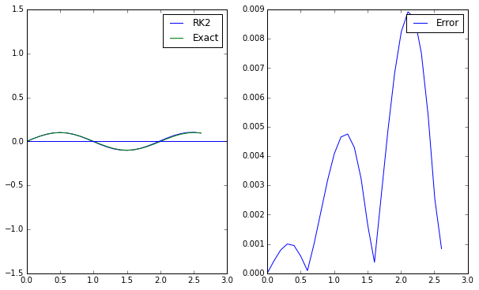

\pagebreak

### Phase Portrait of the Pendulum

    def fpend(Y):
        y1, y2 = Y
        return [y2, -np.sin(y1)]
    
    
    plt.figure(figsize=(20,10))
    
    phi1 = np.linspace(-6,6.0, 40)
    phi2 = np.linspace(-8,8.0, 40)
    
    Phi1, Phi2 = np.meshgrid(phi1, phi2)
    
    u, v = np.zeros(Phi1.shape), np.zeros(Phi2.shape)
    
    NI, NJ = Phi1.shape
    
    for i in range(NI):
        for j in range(NJ):
            x = Phi1[i, j]
            y = Phi2[i, j]
            phidot = fpend([x, y])
            u[i,j] = phidot[0]
            v[i,j] = phidot[1]
         
    
    Q = plt.quiver(Phi1, Phi2, u, v, color='black', linewidths=(.25,))
    
    Pendulum_4_RK    = RK_pend_method([np.pi/6,0],1,2,.1)
    plt.plot(Pendulum_4_RK[1][:,0],Pendulum_4_RK[1][:,1],label="RK2")
    Pendulum_4_exact    = RK_pend_method([np.pi/6,0],1,2,.1)
    plt.plot(Pendulum_4_RK[1][:,0],Pendulum_4_RK[1][:,1],label="RK2")
    Pendulum_5_RK    = RK_pend_method([np.pi/3,0],1,2,.1)
    plt.plot(Pendulum_5_RK[1][:,0],Pendulum_5_RK[1][:,1],label="RK2")
    Pendulum_4_RK    = RK_pend_method([np.pi/6,0],1,2,.1)
    plt.plot(Pendulum_4_RK[1][:,0],Pendulum_4_RK[1][:,1],label="RK2")
    
    
    
    plt.xlabel('$\phi_1$')
    plt.ylabel('$\phi_2$')
    plt.xlim([-3, 3])
    plt.ylim([-4, 4])

    (-4, 4)

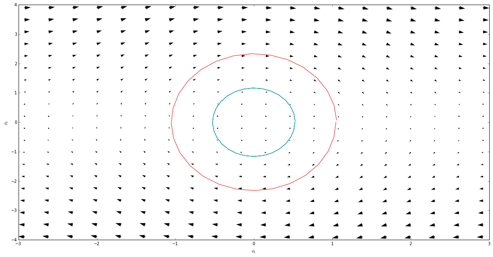

